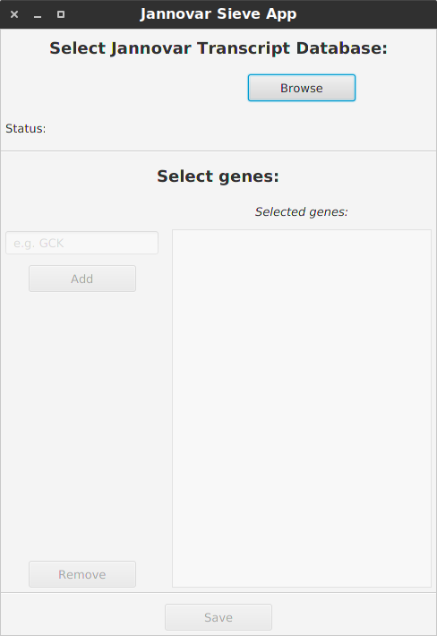
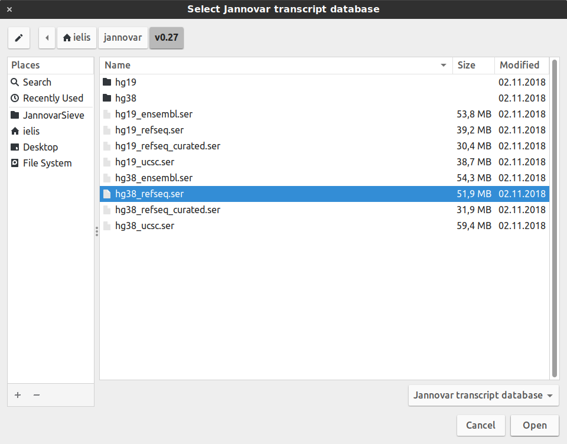
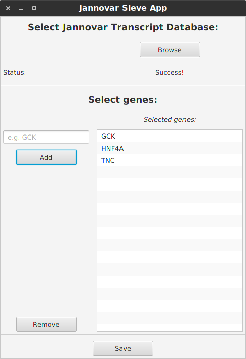
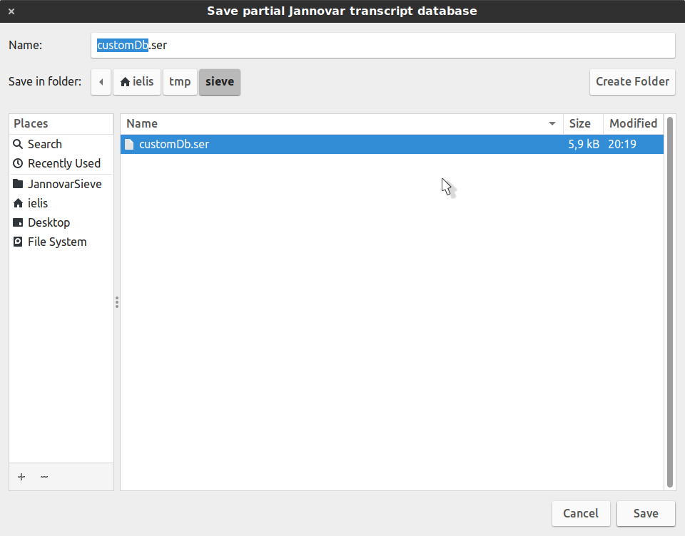

# Jannovar Sieve

App aimed for creating small Jannovar transcript database containing
just a few genes from the full database. This smaller database is useful for testing.

## How to use

- compile the app, if you do not have the JAR already and run it
```bash
mvn clean package
java -jar jannovar-sieve-gui/target/jannovar-sieve-gui-1.0.jar
```

- the app consists of a single dialog window. Hit `Browse` button to select Jannovar database to work with



- navigate through your system to the folder containing full Jannovar databases



- the app will deserialize the selected database in a few seconds. After that buttons and fields in the lower part of the dialog will be enabled. Now you are ready to select genes that you want to add to your smaller database.

  Start typing a gene symbol of your choice into the text field (e.g. `GCK` for glucokinase). Autocompletion box will offer you the genes that are present in the database. Select the gene and hit `Add` button. The gene symbol will be added to the right side of the window



- hit the `Save` after selecting all the genes you want



Your database is ready to use!